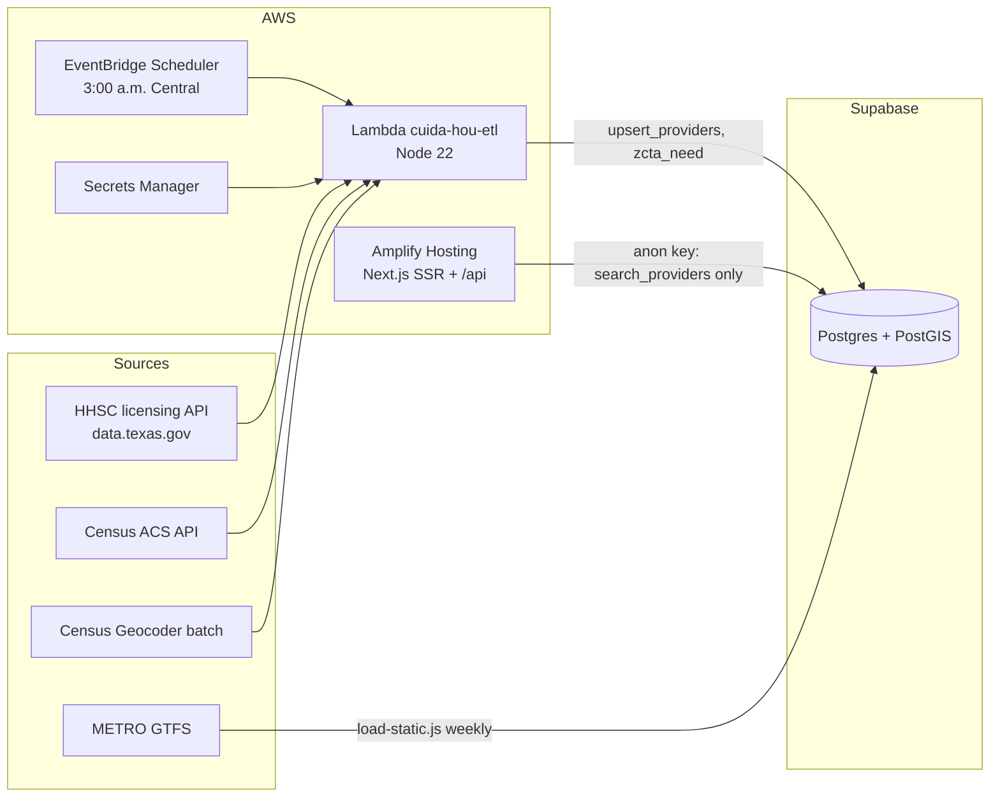

# Cuida HOU — Technical Design (v0.1, 2026-09-26)

## Architecture

**Why Supabase and not RDS:** RDS supports PostGIS, but an always-on instance costs money from day one and needs VPC setup. Supabase is faster for the weekend. Migrating later is a standard `pg_dump`/restore; nothing in the app is Supabase-specific except the JS client.

## Pipeline (`services/etl`)

| Step | Module | Notes |
|---|---|---|
| Fetch | `hhsc.js` | SODA API, `county='HARRIS' AND operation_status='Y'`, day-care types only, paged by 1,000 |
| Clean | `clean.js` | ZIP+4 with a space → 5 digits; strip `TX-` address artifact; parse text hours; split ages; `row_hash` for change detection |
| Geocode | `geocode.js` | Census batch (≤10,000/file) only for new/changed rows; returns point + tract |
| Privacy | `clean.js#approxPoint` | Home types rounded to a ~500 m grid; street address never returned publicly |
| Census | `acs.js` | B23008 (children under 6 by parents' work), B03002 (incl. Black Hispanic, `_014`) by ZCTA. **Verify variable IDs** against `variables.json` for the ACS year used |
| Need | `need.js` | `seats_per_100 = capacity / children_u6_working × 100`; desert if < 33.3 |
| Transit | `gtfs.js` + `load-static.js` | Streams `stop_times.txt`; routes per stop |
| Load | `handler.js` | `upsert_providers()` RPC; missing operations marked `active=false`, never deleted |

## Data model

See `supabase/migrations/20260926000000_init.sql`. Tables: `providers`, `zcta_need`, `transit_stops`, `pathway_steps`, `partners`, `provider_leads` (P1, PII), `seat_reports` (P1). Generated `geography` columns with GiST indexes.

## Access control (tested locally with PostgREST)

| Role | providers | zcta_need / transit / pathway | search_providers() | upsert_providers() | provider_leads |
|---|---|---|---|---|---|
| anon (web) | ❌ blocked | ✅ read | ✅ | ❌ blocked | ❌ |
| service_role (Lambda) | ✅ | ✅ | ✅ | ✅ | ✅ |

`search_providers()` is `security definer` and returns only public-safe columns: `address_line` is null and coordinates are approximate for home providers.

## API

| Endpoint | Purpose |
|---|---|
| `GET /api/providers?zip=77021&age=Toddler&subsidy=1&opensBy=06:30` | JSON search. 400 on bad ZIP, 503 if DB not configured. `s-maxage=3600` for CloudFront |
| `/{es,en}` | Search page (server-rendered, works without JS) |
| `/{es,en}/provider-path` | Pathway steps with source link and verified/unverified label |

## Hosting and cost

| Item | Hackathon | Pilot |
|---|---|---|
| Amplify, Lambda, EventBridge, Secrets Manager | New-account credits (up to $200) / free plan for accounts created after Jul 15, 2025 | Pay as you go; low at pilot traffic. Apply for AWS nonprofit/startup credits |
| Supabase | Free (pauses after 7 idle days) | Pro (~$25/mo; check current pricing) |
| Census, HHSC, Geocoder, GTFS | Free | Free |
| People: coordinator, Spanish review, legal review | Volunteers | The real pilot cost; budget TBD |

Set an **AWS Budgets alarm at $10 and $50 on day one.**

## Known gotchas

- Amplify doesn't expose console env vars to the SSR runtime; `amplify.yml` writes public-safe ones to `.env.production`. Never put the service role key in Amplify.
- Set `AMPLIFY_MONOREPO_APP_ROOT=apps/web` in Amplify.
- ZIP (USPS) ≠ ZCTA (Census). Search uses ZIP; need scores use ZCTA.
- `acs.js` filters to Harris County with the Census 2020 ZCTA–county relationship file (143 ZCTAs; 22 cross a county line).
- Licensed capacity ≠ open seats. The UI says so on every search.
