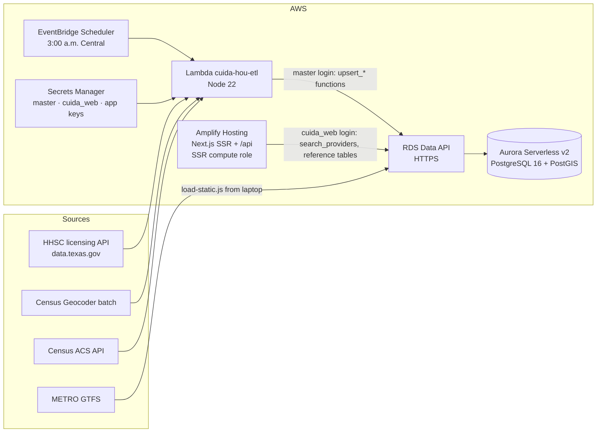

# Cuida HOU — Technical Design (v0.1, 2026-09-26)

## Architecture (all AWS)

**Why Aurora Serverless v2 + Data API:** it's PostgreSQL with PostGIS (same SQL as before), it pauses when idle (`MinCapacity=0`), and the Data API lets Lambda and Amplify query it over HTTPS with IAM. That avoids a VPC-attached Lambda and a NAT gateway (roughly $30+/month on its own). Trade-off: the first request after a pause waits about 15 seconds, so keep `MinCapacity=0.5` during demos.

**Two drivers, one SQL:** production uses the RDS Data API; local development and CI use `pg` against Postgres + PostGIS through `DATABASE_URL`. Every web query returns rows as JSON text (`to_jsonb(...)::text`) so both drivers give identical results, including arrays. The pipeline writes through `upsert_*` functions that take one `jsonb` parameter, because the Data API only sends scalar parameters. Payloads are chunked under 60 KB; responses stay under the Data API's 1 MiB limit.

## Pipeline (`services/etl`)

| Step | Module | Notes |
|---|---|---|
| Fetch | `hhsc.js` | SODA API, `county='HARRIS' AND operation_status='Y'`, day-care types only, paged by 1,000 |
| Clean | `clean.js` | ZIP+4 with a space → 5 digits; strip `TX-` address artifact; parse text hours; split ages; `row_hash` for change detection |
| Geocode | `geocode.js` | Census batch (≤10,000/file) only for new/changed rows; returns point + tract |
| Privacy | `clean.js#approxPoint` | Home types rounded to a ~500 m grid; street address never returned publicly |
| Census | `acs.js` | B23008 (children under 6 by parents' work), B03002 (incl. Black Hispanic, `_014`) by ZCTA. **Verify variable IDs** against `variables.json` for the ACS year used |
| Need | `need.js` | `seats_per_100 = capacity / children_u6_working × 100`; desert if < 33.3 |
| Transit | `gtfs.js` + `load-static.js` | Streams `stop_times.txt`; routes per stop |
| Load | `handler.js` + `db.js` | `upsert_providers()`, `mark_providers_inactive()`, `upsert_zcta_need()` via Data API; missing operations marked inactive, never deleted |

## Data model

See `db/migrations/` (applied by `npm run db:migrate`, tracked in `schema_migrations`). Tables: `providers`, `zcta_need`, `transit_stops`, `pathway_steps`, `partners`, `provider_leads` (P1, PII), `seat_reports` (P1). Generated `geography` columns with GiST indexes.

## Access control (tested: `services/etl/test/e2e-local.mjs`, runs in CI)

| Login | providers (raw rows) | zcta_need / transit / pathway | search_providers() | upsert_* functions | provider_leads |
|---|---|---|---|---|---|
| `cuida_web` (web app) | ❌ denied | ✅ read | ✅ | ❌ denied | ❌ denied |
| `cuida_admin` master (pipeline, migrations) | ✅ | ✅ | ✅ | ✅ | ✅ |

`search_providers()` is `security definer` and returns only public-safe columns: `address_line` is null and coordinates are rounded for home providers. The Amplify compute role can read only the `cuida_web` secret, never the master secret.

## API

| Endpoint | Purpose |
|---|---|
| `GET /api/providers?zip=77021&age=Toddler&subsidy=1&opensBy=06:30` | JSON search. 400 on bad ZIP, 503 if DB not configured. `s-maxage=3600` for CloudFront |
| `/{es,en}` | Search page (server-rendered, works without JS) |
| `/{es,en}/provider-path` | Pathway steps with source link and verified/unverified label |

## Hosting and cost

| Item | Hackathon / pilot |
|---|---|
| Aurora Serverless v2 | Per ACU-hour (about $0.12 in us-east-1, estimate) + storage. Pauses when idle; ~$1.50/day if held at 0.5 ACU |
| Lambda, EventBridge, SNS, Data API, Amplify | Cents to a few dollars at this traffic |
| Census, HHSC, Geocoder, GTFS | Free |
| Account credit | $100, enough for the hackathon and a pilot month |
| People: coordinator, legal review | Still the real pilot cost |

Set **AWS Budgets alarms at $10 and $50** before deploying.

## Known gotchas

- Amplify doesn't expose console env vars to the SSR runtime; `amplify.yml` writes the non-secret ARNs to `.env.production`. Database access comes from the SSR compute role, not stored keys. Attach the role at branch level (public repo).
- Aurora resume after auto-pause takes ~15 s (longer after 24 h idle).
- The Data API is only tested here through its contract; the `pg` path is tested end to end. Test on AWS before the demo.
- Set `AMPLIFY_MONOREPO_APP_ROOT=apps/web` in Amplify.
- ZIP (USPS) ≠ ZCTA (Census). Search uses ZIP; need scores use ZCTA.
- `acs.js` filters to Harris County with the Census 2020 ZCTA–county relationship file (143 ZCTAs; 22 cross a county line).
- Licensed capacity ≠ open seats. The UI says so on every search.
